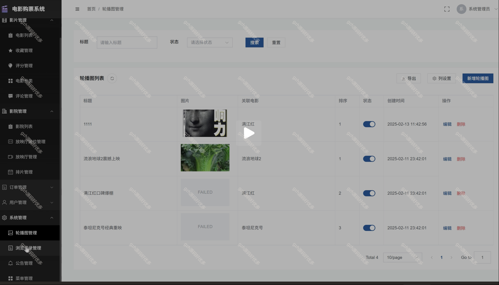

# springbootA372
springbootA372基于协同过滤算法的电影院管理系统
 
## 查看主页获取源码

### 一、关键词

协同过滤电影推荐系统、电影院管理系统、电影购票系统

### 二、作品包含

源码+数据库+全套环境和工具资源+部署教程

### 三、项目技术

前端技术：Html、Css、Js、Vue3、Element-ui 
数据库：MySQL
后端技术：Java、SpringBoot2.0、MyBatis

  

### 四、运行环境

开发工具：IDEA/eclipse  + vscode

数据库：MySQL8

数据库管理工具：Navicat10以上版本

环境配置软件： JDK17 + Maven3.6.3

前端Nodejs：16

浏览器：谷歌浏览器

### 五、项目介绍

项目编号：springbootA372

基于协同过滤算法的电影院订票系统是融合票务销售、排片放映、用户运营及数据管理的数字化平台，通过集成线上线下票务渠道，
一、角色设计
1. 游客
- 浏览电影信息
- 查看排行榜
- 注册账号

2. 注册用户
- 登录/注销
- 浏览电影信息
- 购票
- 收藏电影
- 评分评论
- 查看个人订单
- 管理个人信息

3. 管理员
- 系统管理
- 内容管理
- 订单管理
- 用户管理
- 数据统计

二、功能模块划分
1. 用户认证模块
- 登录
- 注册

2. 首页模块
- 轮播图展示
- 公告展示
- 热门电影推荐（基于用户行为：用户订单，浏览，收藏记录来进行推荐）
- 即将上映预告

3. 电影管理模块
- 电影分类展示
- 电影详情
- 电影排行榜
- 电影收藏
- 电影评分评论

4. 订票模块
- 影院选择
- 场次选择
- 座位选择
- 订单生成
- 支付处理

5. 个人中心模块
- 个人信息管理
- 订单管理
- 收藏管理
- 评论管理

6. 后台管理模块
- 轮播图管理
- 公告管理
- 电影管理
- 影院管理
- 场次管理
- 订单管理
- 用户管理
- 评论管理
- 数据统计

### 六、运行截图

